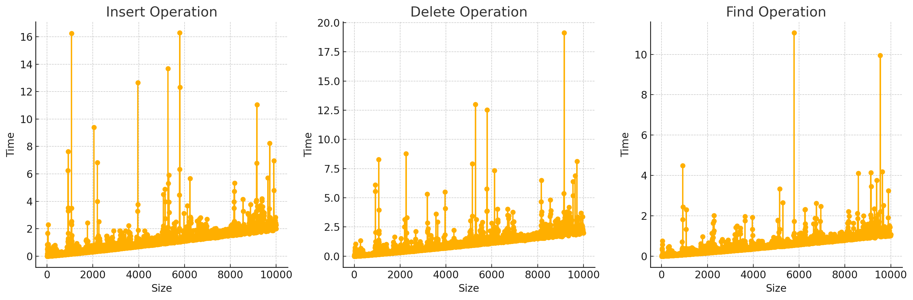

# Projector HSA Home work #18: Data Structures and Algorithms

## Task:

№1 Implement class for **Balanced Binary Search Tree** that can insert, find and delete elements.

- Generate 100 random datasets and measure complexity.

№2 Implement Counting Sort algorithm.

- Figure out when Counting Sort doesn’t perform.

## Results:

**№1**

The DS is implemented in this file: [balanced-bst.js](./balanced-bst.js).

This is visualizations:

**№2**

The method is implemented in this file: [counting-sort.js](./counting-sort.js)
Counting Sort doesn't perform well when there is a huge range of the numbers.
Because we need to create a helping array for storing counts.
